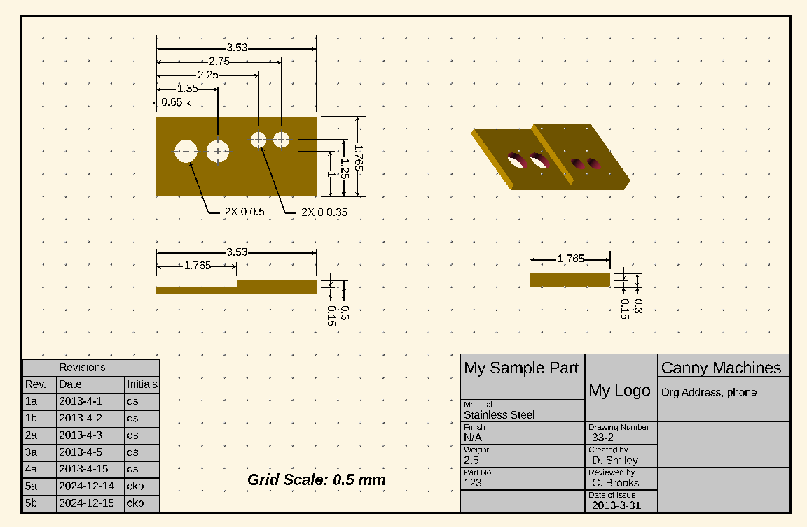
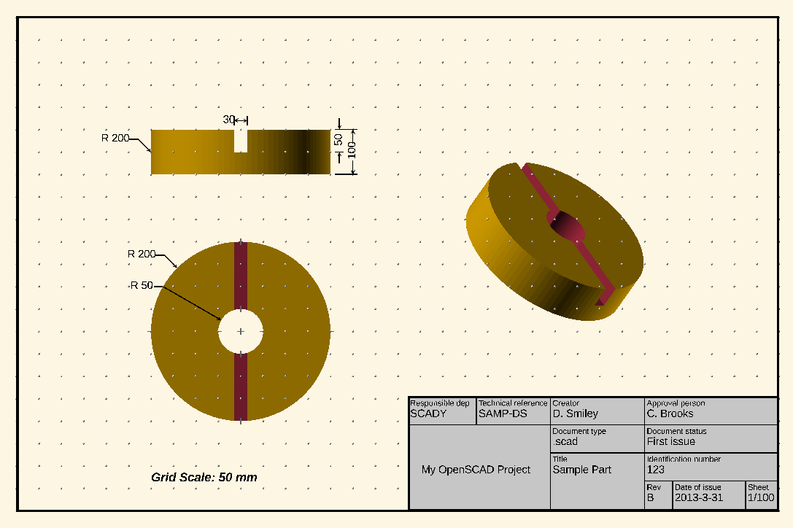

# DraftSCAD

OpenSCAD is an open-source program used to create 3D objects. Part of its appeal stems from its text-based input, which specifies the objects, placement, rotation, and other features. Unlike some other 3D programs, such as Blender, OpenSCAD provides precise, programmatic control over the characteristics of objects, enabling a streamlined design process without the need for manual adjustments on-screen.

However, creating manual machining equipment or workshop-ready creations often requires annotated engineering drawings—something OpenSCAD doesn't natively provide. To make matters worse the mesh-based nature of the program means that we cannot easily export to a format in which we can use classic CAD programs to then annotate our part even if we wanted to take this work around. Hence, this utility library aims to fill that gap by enabling the creation of dimensioned drawings directly within OpenSCAD.

## Approach

This library employs a top-down view in OpenSCAD, with dimensioned lines and text displayed on the XY plane. By combining multiple views of your object with projected and translated dimensioned lines, you can create the illusion of a complete dimensioned drawing.

A number of elements must come together to implement dimensioning:

- Lines, with or without arrows.
- Annotated dimensions and other textual descriptions.
- Support for common annotation conventions.

The library includes a partial implementation of these features, making it functional yet extensible for future improvements.

To get started, explore the [documentation](docs/README.md) and the [examples](examples/README.md). Quick-start guides and further simplifications are planned for future releases.

## Future Directions

- **Additional Symbols**: Expanding the library with more standardized symbols for engineering drawings.
- **Improved Scaling**: Developing methods to better control image scaling and output resolution, including specifying viewports and setting pixels per inch.

## Acknowledgements

This repository builds upon the work of:

- Don Smiley from [Canny Machines](http://cannymachines.com/entries/9/openscad_dimensioned_drawings).
- pwpearson's enhancements on Canny Machines: [dimensional-drawings](https://github.com/pwpearson/dimensional-drawings).
